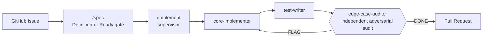

# Agentic SDLC Pipeline

**If you cannot trust your agent, you cannot make it write quality code.**

Not trust as in blind faith — trust as in you've built enough real structure around it that doing the wrong thing is *structurally* harder than doing the right thing. That's the whole bet this repo makes.

## Why this exists

I kept doing the same thing to Claude, over and over: "are you sure you got everything?" "I know you said this is the final design, but I bet we can do better." And every single time — "oh yeah, I totally missed that part."

Not once in a while. Every time, if I pushed hard enough. That's not really a Claude-specific problem — it's what happens whenever the same agent that wrote the code is also the one grading whether the code is done. Ask it if it's sure, and it'll go find something, because "sure" was never actually checked in the first place.

So I stopped asking nicely and built a system that doesn't let an agent grade its own homework. `edge-case-auditor` derives its own list of what could go wrong from the spec — before it's allowed to read the implementer's code or the test-writer's tests — so it can't just rubber-stamp whatever blind spots they already share.

## The actual point

Here's the part that isn't about the code at all: **the system is only as good as I am.**

If I miss something, the pipeline is supposed to catch it and tell me — not quietly work around it, not paper over it with a "looks good" that makes both of us feel better. A well-intentioned agent covering for my blind spot doesn't fix the blind spot. It just makes it more expensive to find later.

So the pipeline logs and the adversarial-audit design aren't just there to catch bugs in the code. They're there to catch the gaps in *my own* thinking before those gaps get expensive. Surface what I'm missing → I get sharper because of it → repeat. That's a genuinely different goal from most agent-tooling projects, which are entirely about making the agent more reliable. This one is also about making me more reliable, using the agent as the thing that keeps me honest.

## It's not hypothetical

Two independent projects run this pipeline in production today (see [`Adopters.md`](Adopters.md)) — real GitHub issues, driven end-to-end through spec → implement → test → adversarial audit → merged, green-CI PR. On the most recent adoption, `doc-keeper`'s very first audit run found real, live documentation drift on the first try — stale docs and a missing changelog entry, caught by the structure doing its job, not by me remembering to check.

I've also killed my own work the same day I built it, when it violated a principle I actually cared about. An earlier skill, `/onboard`, installed the *entire* template set into every project it touched — no relevance check, no judgment, just "here's everything." I tore it down within hours, for two reasons: it wasn't asked for, and "not every project needs every agent" was a rule I'd already written down and then immediately broken. `project-lifecycle.md` is the rebuild — it evidence-scores what a project actually needs before installing anything, and a project correctly ending up with zero templates installed is treated as a valid outcome, not a bug.

## At a glance

| | |
|---|---|
| **Agent templates** | 14 — each does one job, returns a result, isolated context |
| **Skill templates** | 6 — orchestration-capable, run inline with full tool access |
| **Design principles** | 21, each grounded in a real incident or a citable source, not intuition |
| **Adopted by** | 2 independent projects, evidence-scored per project rather than installed wholesale |

## How the core loop works

## Design highlights

A few of the decisions I'd actually defend in an interview:

- **Adversarial verification, not a second opinion.** The auditor's edge-case list is derived from intent first, reconciled against the spec's own table second, and only then checked against the real diff — reading the code first would mean only ever imagining the edge cases the code already has a branch for. [→ Principles.md](Principles.md#adversarial-verification-assume-both-are-wrong)
- **Guardrails need an anchor outside the agent's own context.** A rule written into a prompt isn't durable — context-window compression can silently drop a safety instruction as low-priority filler among thousands of tokens. Every guardrail here (CI, two-step confirmations, independent audits) lives somewhere an agent's own session can't quietly talk its way around. [→ Principles.md](Principles.md#guardrails-need-an-anchor-outside-the-agents-own-context-not-just-good-prompting)
- **Templates carry a real semver.** A prompt file versions like a deployed API contract here — major/minor/patch decided by whether an adopter's already-installed copy would break, not by how much text moved around. [→ Principles.md](Principles.md#templates-carry-a-real-semver-not-just-a-version-string-decoration)
- **Not "customizable" in the vague, mainstream-advice sense.** I actually checked whether Claude Code's own plugin `userConfig` system already solved this — it doesn't. `userConfig` only handles short scalar fields, not the prose-heavy `[CUSTOMIZE: ...]` judgment calls these templates need filled in. Built for a real, documented gap, not because "customizable" sounds good on a landing page.

## What's inside

| Path | What it is |
|---|---|
| [`Principles.md`](Principles.md) | The design rules, each grounded in a real incident or a named source — read this first |
| [`Templates/Agents/`](Templates/Agents) | 14 specialist agent definitions: implementer, test-writer, adversarial auditor, IaC specialist, doc-keeper, and more |
| [`Templates/Skills/`](Templates/Skills) | 6 orchestration-capable skills: the implementation supervisor, spec-writer, cleanup sweep, periodic pipeline review |
| [`Timeline.md`](Timeline.md) | Narrative log of when and why the pipeline's shape changed — including what got built and torn down same-day when it turned out wrong |
| [`Adopters.md`](Adopters.md) / [`adopters.yaml`](adopters.yaml) | Real projects running this pipeline today, and what's installed where |
| [`Adoption Checklist.md`](Adoption%20Checklist.md) | Step-by-step guide to bringing this into a new project |

## Grounded in, not invented

I don't get to add a new principle or template just because it feels right — it has to cite what it's grounded in: a real incident (see `Timeline.md`), an established practice (ITIL change-management tiers, the Twelve-Factor App, semver.org, Conventional Comments), or documented agentic-systems research. "My gut says X" isn't something a future reader, or an interviewer, can push back on — so I don't let myself write it.

## A note on how this was built

Claude wrote most of the actual prose in these templates, and most of the code in `scripts/lint_vault.py`. I'm not going to pretend otherwise. What's mine is the judgment: which incidents were worth writing a principle for, which templates needed to exist at all, when a design was wrong enough to tear down and rebuild the same day, and where this repo's own claims about itself had gaps. That's the differentiator I'd actually defend — not that I hand-typed every line.

## About me

CS degree (Cum Laude, University of South Florida, Dec 2025), AWS Certified Solutions Architect – Associate, a cloud engineering internship at Atex Trade, currently in EPAM's DevOps Lab program. I moved from straight software engineering into DevOps because routine implementation work didn't hold my interest — agent orchestration turned out to be exactly the kind of systems-level, non-routine problem I was looking for. This pipeline is what I built while chasing that problem seriously.

## License

[MIT](LICENSE)
