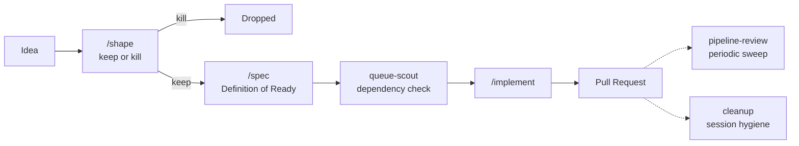
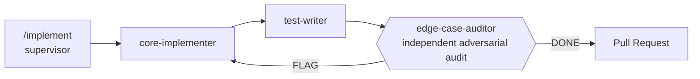

# Agentic SDLC Pipeline

**If you cannot trust your agent, you cannot make it write quality code.**

Not trust as in blind faith — trust as in you've built enough real structure around it that doing the wrong thing is *structurally* harder than doing the right thing. That's the whole bet this repo makes.

## Why this exists

I kept doing the same thing to Claude, over and over: "are you sure you got everything?" "I know you said this is the final design, but I bet we can do better." And every single time — "oh yeah, I totally missed that part."

Not once in a while. Every time, if I pushed hard enough. That's not really a Claude-specific problem — it's what happens whenever the same agent that wrote the code is also the one grading whether the code is done. Ask it if it's sure, and it'll go find something, because "sure" was never actually checked in the first place.

So I built a system where no agent — mine or Claude's — gets to certify its own work as done. An independent check has to be able to confirm it without me asking twice. `edge-case-auditor` derives its own list of what could go wrong from the spec — before it's allowed to read the implementer's code or the test-writer's tests — so it can't just rubber-stamp whatever blind spots they already share.

## The actual point

No one gets to certify their own work as done — not the agent, and not me. That's not a rule I'm imposing on Claude from above; it's the same rule applied to both of us. An implementer that reviews its own diff has the same blind spot as an engineer who reviews their own PR: both already believe it's correct, or they wouldn't have shipped it.

The pipeline logs and the adversarial-audit design exist for exactly this reason — not just to catch bugs in the code, but to catch gaps in the reasoning behind a design decision before they get expensive. That's a different goal from most agent-tooling projects, which optimize purely for making the agent more reliable. This one applies the same independent-verification standard to both sides of the loop.

## It's not hypothetical

Two independent projects run this pipeline in production today (see [`Adopters.md`](Adopters.md)) — real GitHub issues, driven end-to-end through spec → implement → test → adversarial audit → merged, green-CI PR. On the most recent adoption, `doc-keeper`'s very first audit run found real, live documentation drift on the first try — stale docs and a missing changelog entry, caught by the structure doing its job, not by me remembering to check.

There's also `/onboard`, an earlier skill for the same install step. I built it, used it once, and pulled it the same day — it worked, but it installed everything into every project with no relevance check, which is exactly the discipline I'd already written down elsewhere and immediately violated. `project-lifecycle.md` is the rebuild: it evidence-scores what a project actually needs before installing anything, and a project correctly ending up with zero templates installed is treated as a valid outcome, not a bug.

## At a glance

| | |
|---|---|
| **Agent templates** | 14 — each does one job, returns a result, isolated context |
| **Skill templates** | 6 — orchestration-capable, run inline with full tool access |
| **Design principles** | 21, each grounded in a real incident or a citable source, not intuition |
| **Adopted by** | 2 independent projects, evidence-scored per project rather than installed wholesale |

## How the pipeline works

| Skill | What it does |
|---|---|
| `/shape` | Idea intake — ICE-scored, pre-mortem'd, kill criteria pre-registered before work starts. Kills the idea or hands off to `/spec`, never both silently. |
| `/spec` | Turns a shaped idea into a Definition-of-Ready spec — surfaces every conflict or ambiguity up front, so the implementer never has to stop and ask about it mid-build. |
| `/implement` | The core loop — implement, test, independent adversarial audit, then PR. |
| `queue-scout` | Verifies dependencies and feasibility across the whole backlog before anything runs in parallel. |
| `pipeline-review` | Periodic broad sweep over the pipeline's own logs — catches what the automatic per-event checks structurally can't. |
| `cleanup` | End-of-session worktree/branch/issue hygiene, so nothing gets left dirty between sessions. |

### Zooming into `/implement`

The audit step is the load-bearing one: `edge-case-auditor` derives its own list of edge cases from the issue's stated guarantees **before** it reads a single line of the implementation or the tests. See [Adversarial verification: assume both are wrong](Principles.md#adversarial-verification-assume-both-are-wrong).

## Design highlights

A few of the decisions I'd actually defend in an interview:

- **Adversarial verification, not a second opinion.** The auditor's edge-case list is derived from intent first, reconciled against the spec's own table second, and only then checked against the real diff — reading the code first would mean only ever imagining the edge cases the code already has a branch for. [→ Principles.md](Principles.md#adversarial-verification-assume-both-are-wrong)
- **Guardrails need an anchor outside the agent's own context.** A rule written into a prompt isn't durable — context-window compression can silently drop a safety instruction as low-priority filler among thousands of tokens. Every guardrail here (CI, two-step confirmations, independent audits) lives somewhere an agent's own session can't quietly talk its way around. [→ Principles.md](Principles.md#guardrails-need-an-anchor-outside-the-agents-own-context-not-just-good-prompting)
- **Templates carry a real semver.** A prompt file versions like a deployed API contract here — major/minor/patch decided by whether an adopter's already-installed copy would break, not by how much text moved around. [→ Principles.md](Principles.md#templates-carry-a-real-semver-not-just-a-version-string-decoration)
- **Not "customizable" in the vague, mainstream-advice sense.** I checked whether Claude Code's own plugin `userConfig` system already solved this — it doesn't. `userConfig` only handles short scalar fields, not the prose-heavy `[CUSTOMIZE: ...]` judgment calls these templates need filled in. Built for a real, documented gap, not because "customizable" sounds good on a landing page.

## What's inside

| Path | What it is |
|---|---|
| [`Principles.md`](Principles.md) | The design rules, each grounded in a real incident or a named source — read this first |
| [`Templates/Agents/`](Templates/Agents) | 14 specialist agent definitions: implementer, test-writer, adversarial auditor, IaC specialist, doc-keeper, and more |
| [`Templates/Skills/`](Templates/Skills) | 6 orchestration-capable skills: the implementation supervisor, spec-writer, cleanup sweep, periodic pipeline review |
| [`Timeline.md`](Timeline.md) | Narrative log of when and why the pipeline's shape changed — including what got built and torn down same-day when it turned out wrong |
| [`Adopters.md`](Adopters.md) / [`adopters.yaml`](adopters.yaml) | Real projects running this pipeline today, and what's installed where |
| [`Adoption Checklist.md`](Adoption%20Checklist.md) | Step-by-step guide to bringing this into a new project |

## Grounded in, not invented

Every new principle or template here cites what it's grounded in: a real incident (see `Timeline.md`), an established practice (ITIL change-management tiers, the Twelve-Factor App, semver.org, Conventional Comments), or documented agentic-systems research. "My gut says X" isn't something a future reader, or an interviewer, can push back on, so it doesn't get written.

Claude wrote most of the actual prose in these templates. What's mine is the judgment underneath it — which incidents were worth a principle, which templates needed to exist at all, and when a design was wrong enough to tear down and rebuild the same day.

## About me

I moved from straight software engineering into DevOps because routine implementation work didn't hold my interest — agent orchestration turned out to be exactly the kind of systems-level, non-routine problem I was looking for, and this pipeline is what came out of chasing it. (CS degree, Cum Laude, University of South Florida, Dec 2025; AWS Certified Solutions Architect – Associate; currently in EPAM's DevOps Lab program, after a cloud engineering internship at Atex Trade.)

## License

[MIT](LICENSE)
