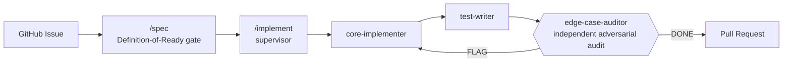

# Agentic SDLC Pipeline

A generalized template set for running the software delivery lifecycle through a multi-agent [Claude Code](https://claude.com/claude-code) pipeline: a supervisor skill claims a piece of work and dispatches specialist agents — implement, test, adversarially audit, check infra, keep docs in sync — through to a reviewed pull request.

This isn't a demo. It's the real, generalized template set behind a pipeline that's been driving actual GitHub issues to merged, green-CI PRs across two independently adopted projects, with every design rule below traceable to a specific incident that motivated it.

> _[One or two sentences on why you built this / what it's for — personalize before interviews.]_

## At a glance

| | |
|---|---|
| **Agent templates** | 14 — each does one job, returns a result, isolated context |
| **Skill templates** | 6 — orchestration-capable, run inline with full tool access |
| **Design principles** | 21, each grounded in a real incident or a citable source, not intuition |
| **Adopted by** | 2 independent projects, evidence-scored per project rather than installed wholesale |

## How the core loop works

The audit step is the load-bearing one: `edge-case-auditor` derives its own list of edge cases from the issue's stated guarantees **before** it reads a single line of the implementation or the tests — so it can't just inherit whatever blind spots the implementer and test-writer already share. See [Adversarial verification: assume both are wrong](Principles.md#adversarial-verification-assume-both-are-wrong).

## Design highlights

A few of the decisions that make this more than a folder of prompts:

- **Adversarial verification, not a second opinion.** The auditor's edge-case list is derived from intent first, reconciled against the spec's own table second, and only then checked against the real diff — reading code first would mean only imagining edge cases the code already has a branch for. [→ Principles.md](Principles.md#adversarial-verification-assume-both-are-wrong)
- **Guardrails need an anchor outside the agent's own context.** A rule written into a prompt isn't durable — context-window compression can silently drop a safety instruction as low-priority filler. Every guardrail here (CI, two-step confirmations, independent audits) lives somewhere an agent's own session can't talk its way around. [→ Principles.md](Principles.md#guardrails-need-an-anchor-outside-the-agents-own-context-not-just-good-prompting)
- **Templates carry a real semver.** A prompt file versions like a deployed API contract — major/minor/patch defined by whether an adopter's already-installed copy would break, not by how much text changed. [→ Principles.md](Principles.md#templates-carry-a-real-semver-not-just-a-version-string-decoration)
- **The vault↔project relationship is two-way, not adopt-once-and-drift.** `project-lifecycle` evidence-scores which templates a project actually needs before installing anything (a docs-only project can correctly end up with zero); `ecosystem-sync` automatically ports genuinely reusable improvements back from any adopting project into this vault, no manual sync step required.

## What's inside

| Path | What it is |
|---|---|
| [`Principles.md`](Principles.md) | The design rules, each grounded in a real incident or a named source — read this first |
| [`Templates/Agents/`](Templates/Agents) | 14 specialist agent definitions: implementer, test-writer, adversarial auditor, IaC specialist, doc-keeper, and more |
| [`Templates/Skills/`](Templates/Skills) | 6 orchestration-capable skills: the implementation supervisor, spec-writer, cleanup sweep, periodic pipeline review |
| [`Timeline.md`](Timeline.md) | Narrative log of when and why the pipeline's shape changed — including what got built and torn down same-day when it turned out wrong |
| [`Adopters.md`](Adopters.md) / [`adopters.yaml`](adopters.yaml) | Real projects running this pipeline today, and what's installed where |
| [`Adoption Checklist.md`](Adoption%20Checklist.md) | Step-by-step guide to bringing this into a new project |

## Grounded in, not invented

Every new principle or template here has to cite what it's grounded in: a real incident (see `Timeline.md`), an established practice (ITIL change-management tiers, the Twelve-Factor App, semver.org, Conventional Comments), or documented agentic-systems research. "My gut says X" isn't a citation a future reader — or an interviewer — can push back on.

## License

[MIT](LICENSE)
