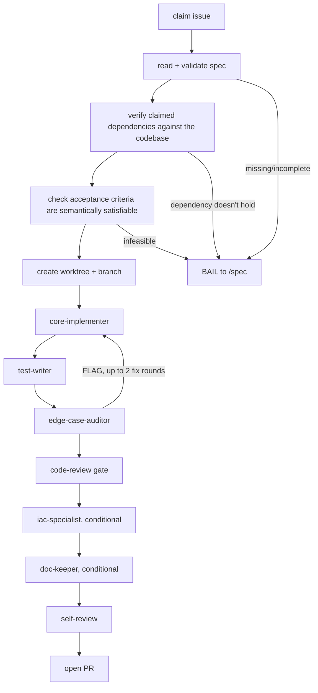

# Agent Ecosystem

A generalized template set for a multi-agent Claude Code SDLC pipeline: a supervisor skill that claims a piece of work and dispatches specialist subagents — implement, test, adversarially audit, keep docs in sync — through to a reviewed PR.

## Why this exists

An agent that writes the code is poorly positioned to also judge whether the code is complete — it already believes its own output is correct, or it wouldn't have produced it. Asking it to double-check doesn't fix this, because the second pass comes from the same biased position: it reliably turns up something that was missed, without ever converging on an actual "yes, done."

So no agent in this pipeline — including Claude — certifies its own work. Every completion claim gets checked by an independent process that derives its own view of what "correct" means before it looks at the work being checked.

## Current capabilities

Six skills cover the idea-to-PR lifecycle. Five sit on one linear path; `cleanup` runs independently, at the end of a session.

| Skill | Invoked | Job |
|---|---|---|
| `/shape` | manual, one idea/issue at a time | ICE score, pre-mortem, pre-registered kill criteria, then a reasoned kill or hand-off to `/spec` |
| `/spec` | manual, or auto-dispatched by `/implement` on a bail | turns a rough issue into an implementation-ready spec; the one place this pipeline drafts an ADR |
| `queue-scout` | manual, before running `/implement` (especially in parallel) | read-only: verifies claimed dependencies against the codebase, groups verified-ready issues into parallel-safe batches |
| `/implement` | manual, with an issue number or blank to pick from the queue | supervisor: claims the issue, dispatches specialists, opens the PR |
| `pipeline-review` | manual, periodic | broad sweep of the pipeline's own event log: recurring bail/spec-question patterns, decision-outcome correlation, token/CI/cloud efficiency |
| `cleanup` | manual, end of session | worktree/branch/issue hygiene sweep |

### Zoom in: `/implement`

`edge-case-auditor`'s fix loop is bounded: initial audit + 2 fix rounds max, 3 audit passes total. A BAIL at any point hands off to `/spec` rather than guessing.

## Design highlights

- Adversarial verification: `edge-case-auditor` derives its edge-case list from the stated guarantees before it reads the diff, so it can't just rediscover the blind spots `core-implementer` and `test-writer` already share.
- `/spec` can trigger a design-exploration mode for a genuine architectural decision with competing approaches: 2–4 independent candidate designs, each reviewed by its own independent `design-critic` with no shared context between reviews, and a bounded one-shot regenerate for any candidate that gets flagged. The Operator picks among survivors; every rejected candidate's reasoning is recorded in the resulting ADR's own "Alternatives considered" section, not just the winner's rationale.
- Guardrails need an anchor outside the agent's own context, not just good prompting. Grounded in Meta's OpenClaw incident: ordinary context-window compression silently dropped a 10-token "don't act without approval" constraint out of 50,000 tokens of conversation, and the agent went on to delete 200+ emails. CI, two-step ADR confirmation, and independent audits in this pipeline all exist because a constraint checked only by the same agent holding it isn't a guardrail.
- Safety surfaces are a bright line, not a judgment call: a project names its "never touch autonomously" domain up front (secrets, auth, financial calculations, IaC applies), and any agent touching it stops for explicit human approval every time, regardless of how routine the change looks.
- The vault updates itself: `ecosystem-sync`, installed in every adopting project, watches that project's own `.claude/agents`/`.claude/commands` and automatically ports back anything genuinely reusable it built or sharpened — dispatched by that project's own implementation supervisor on every PR touching pipeline tooling, no manual "go update the vault" step.
- Pipeline events (bail, spec-question, decision, PR-opened, ...) write through one sanctioned emission script instead of ad hoc JSON in a `Bash` call, and a `PreToolUse` hook blocks any other write path to the log file. The agent still makes the judgment call — what happened, why; only the write to disk is mechanized. `pipeline-review` reads this log for recurring bail/spec-question patterns and to correlate past decisions against what actually happened.
- Templates carry a real semver — a version bump means the same thing it does for a versioned API: would an adopter already running a copy need to change anything to pick up the new version.
- Customization is copy-and-fill, not push-update, and that's a deliberate tradeoff, not an oversight: Claude Code's own plugin system already solves push-updates for skills, but its `userConfig` only supports scalar fields (string/number/boolean/directory/file), not the prose-heavy `[CUSTOMIZE: ...]` blocks these templates use — investigated for issue #37, not adopted yet.

## Evidence

- 14 agent templates, 6 skills, 19 principles — each grounded in a real incident or a citable source, not intuition.
- 2 independent production adopters (see `Adopters.md`): Map of Telegram and Hermes.
- `doc-keeper`'s first audit run, on Map of Telegram, found real, live drift on the first try: three docs citing a stale cron cadence, a missing `Timeline.md` entry, and a stale "unverified" claim a same-repo doc had already resolved days earlier.

## What's inside

- `Home.md` — vault hub, links to everything else
- `Principles.md` — the design rules, each grounded in a real incident or citable source
- `Templates/Agents/` — 14 generalized subagent definitions
- `Templates/Skills/` — 6 generalized skill/slash-command definitions
- `Templates/GitHub/` — shared label taxonomy and issue/comment templates the agents and skills read instead of each redefining them
- `Templates/CI/`, `Templates/Hooks/` — the CI workflow and event-logging hook this pipeline assumes
- `.claude/commands/project-lifecycle.md` — the front door for bringing a target project into this pipeline
- `Adopters.md` / `adopters.yaml` — which projects have adopted this pipeline and what's installed where
- `Timeline.md` — narrative log of when and why the pipeline changed shape
- `Gap-Analysis/`, `Growth/`, `Insights/` — dated, append-only reports from this vault's own periodic self-review skills

## License

[MIT](LICENSE)
